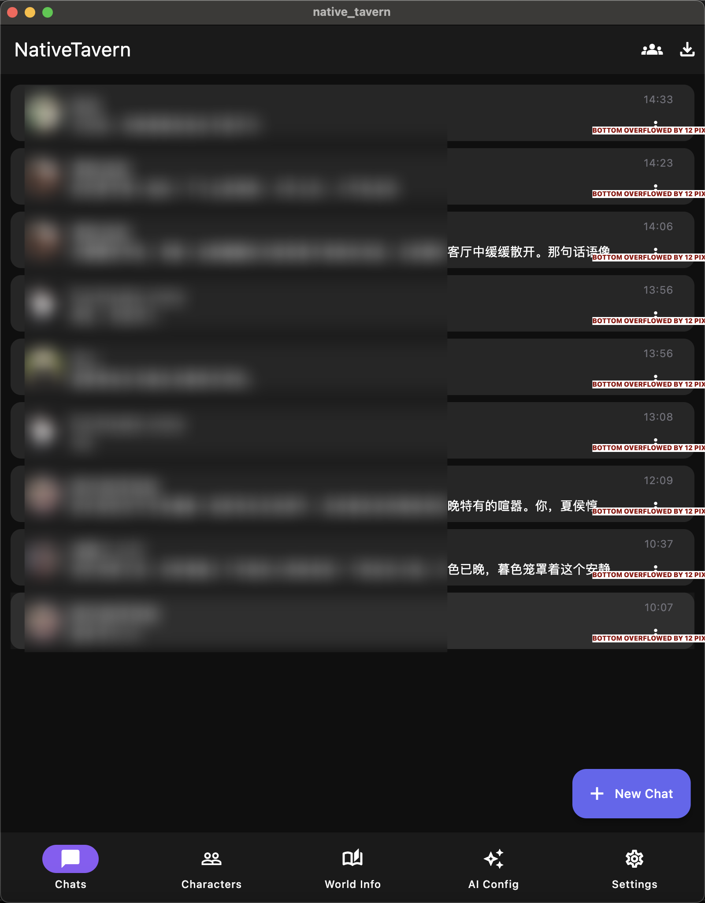
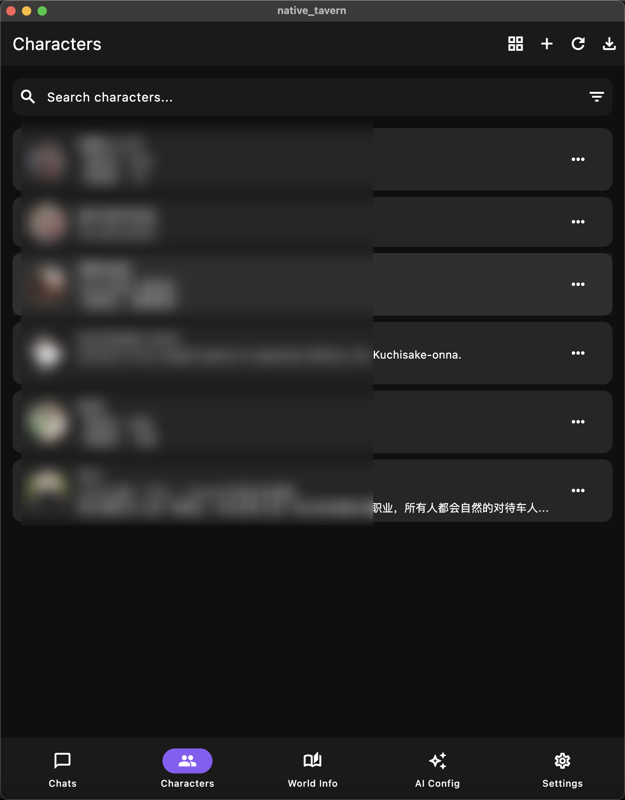
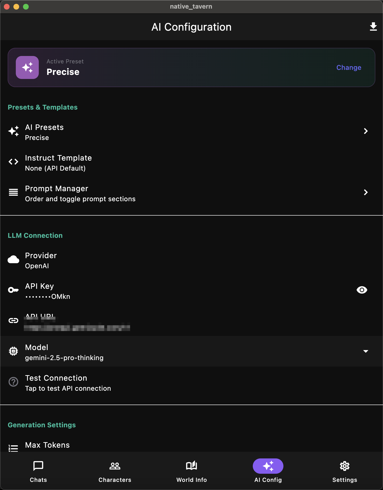
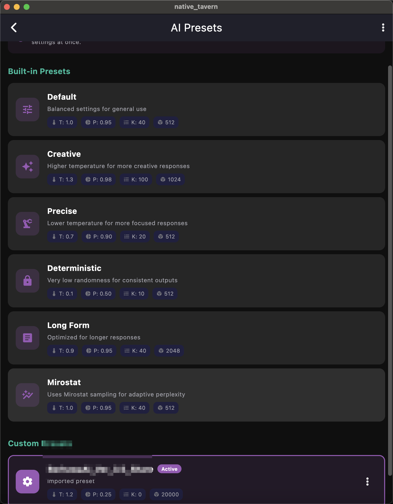
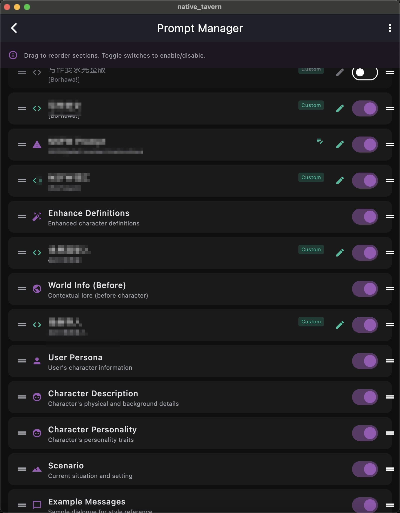
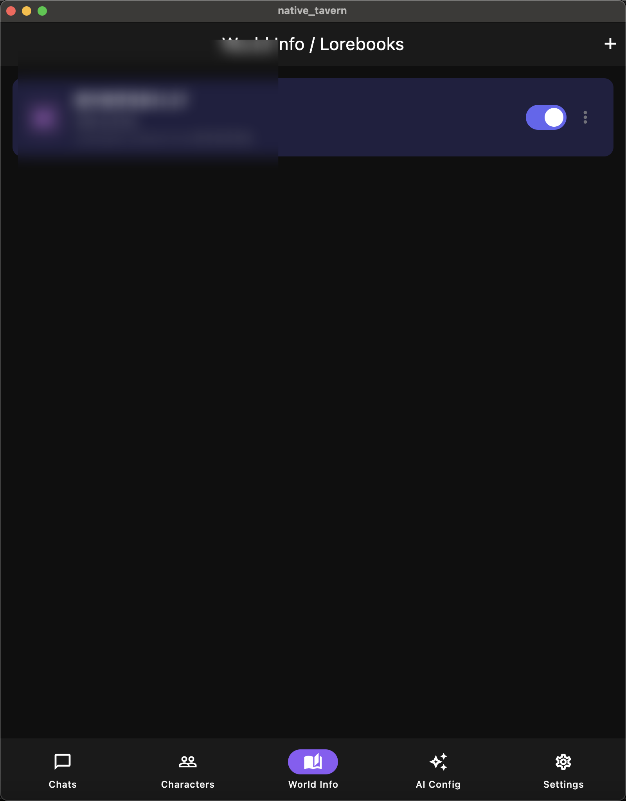

# NativeTavern

<p align="center">
  <a href="README.md">English</a> | <a href="README.zh-CN.md">简体中文</a>
</p>

A native cross-platform mobile application (iOS/Android) that reimplements SillyTavern as a high-performance native app with full compatibility for SillyTavern data formats.

## Screenshots

<p align="center">
  
  
  
</p>

<p align="center">
  
  
  
</p>

| Chat | Character | AI Config |
|:---:|:---:|:---:|
| Real-time streaming chat with message actions | Character cards with avatar and details | Multi-provider LLM configuration |

| AI Preset | Prompt Manager | World Info |
|:---:|:---:|:---:|
| Import SillyTavern presets | Custom prompt ordering | Keyword-based context injection |

## Features

### Core Features ✅
- 📱 **Native Mobile App** - Built with Flutter for iOS and Android
- ⚡ **High Performance** - Optimized for mobile devices
- 🤖 **Multi-Provider LLM Support** - OpenAI, Claude, OpenRouter, Gemini, Ollama, KoboldCpp
- 📦 **Full ST Compatibility** - Import/export PNG cards, CharX, JSON
- 💬 **Streaming Responses** - Real-time SSE streaming from all providers

### Character Management ✅
- 📥 **Import Formats** - PNG V2/V3, CharX (V3 spec), JSON
- 📤 **Export Formats** - PNG V3, CharX with assets, JSON
- ✏️ **Character Editor** - Create/edit characters with all fields
- 🖼️ **Avatar Support** - Custom avatars with image picker
- 📚 **Embedded Lorebooks** - Full CharX lorebook support

### Chat Features ✅
- 💬 **Message Actions** - Edit, delete, regenerate, swipe between alternatives
- 👥 **Group Chats** - Multi-character conversations with 5 response modes
- 🔖 **Bookmarks** - Create checkpoints and branch conversations
- 📝 **Author's Note** - Injection at configurable depth
- 🎭 **Personas** - User profile management with descriptions

### World Info / Lorebook ✅
- 🌍 **Keyword Matching** - Trigger-based context injection
- 📍 **Multiple Positions** - Before/after system prompt, character defs, examples
- 🔄 **Recursion Support** - Nested keyword scanning
- 📊 **Group Scoring** - Priority-based entry selection

### Prompt Management ✅
- 📋 **Prompt Manager** - Ordering, enabling/disabling prompts
- 📥 **SillyTavern Preset Import** - Full prompts + prompt_order support
- 🎯 **Custom Prompts** - Add custom sections with role support
- 📍 **Depth Injection** - Insert prompts at specific message depths

### Advanced Settings ✅
- 🎛️ **Full Sampler Control** - Temperature, Top-P, Top-K, Min-P, Typical-P
- 🔁 **Repetition Penalty** - With configurable range
- 🎲 **Mirostat** - Mode, Tau, Eta settings
- ✂️ **Tail-Free Sampling** - TFS and Top-A support
- 🛑 **Stop Sequences** - Custom stop tokens

### Themes ✅
- 🎨 **18 Built-in Themes** - 7 dark + 11 light themes
- 🌙 **Dark Themes** - Default Dark, Midnight, Forest, Sunset, Rose, Ocean, AMOLED
- ☀️ **Light Themes** - Clean White, Warm Cream, Soft Lavender, Mint Fresh, Sky Blue, Rose Pink, Peach, Sage Green, Paper, Sepia
- 🖌️ **Theme Editor** - Full color customization

### Chain of Thought Support ✅
- 🧠 **OpenAI o1/o3** - Parse `reasoning_content` field
- 💭 **Claude** - Parse `thinking` blocks
- 🤔 **Gemini 2.0 Flash Thinking** - Parse `thought` field
- 💾 **Reasoning Storage** - Save reasoning with messages and swipes

### Macro System ✅
- `{{user}}` - Current persona name
- `{{char}}` - Character name
- `{{time}}` / `{{date}}` / `{{weekday}}` - Date/time macros
- `{{random:min:max}}` - Random number generation
- `{{roll:NdM}}` - Dice rolling
- `{{idle_duration}}` - Time since last message
- `{{lastMessage}}` / `{{lastUserMessage}}` / `{{lastCharMessage}}`

## Tech Stack

| Component | Technology |
|-----------|------------|
| UI Framework | Flutter (Dart) |
| State Management | Riverpod |
| Navigation | go_router |
| Database | SQLite (drift) |
| Native Core | Rust (via FFI) |
| HTTP Client | Dio |

## Project Structure

```
native_tavern/
├── lib/                    # Flutter/Dart code
│   ├── main.dart          # Entry point
│   ├── app.dart           # App configuration
│   ├── core/              # Core utilities
│   ├── data/              # Data layer (models, database, repos)
│   │   ├── models/        # Data models (Character, Chat, Message, etc.)
│   │   ├── database/      # SQLite database with Drift
│   │   └── repositories/  # Data access layer
│   ├── domain/            # Business logic
│   │   └── services/      # LLM service, Macro service, etc.
│   └── presentation/      # UI layer
│       ├── providers/     # Riverpod state management
│       ├── screens/       # App screens
│       ├── widgets/       # Reusable widgets
│       └── theme/         # Theme configuration
├── rust/                   # Rust native core
│   └── src/
│       ├── png_parser.rs  # PNG character card parsing
│       ├── charx_parser.rs # CharX archive handling
│       └── models.rs      # Data models
├── ios/                    # iOS platform code
├── android/                # Android platform code
└── plans/                  # Architecture documentation
```

## Getting Started

### Prerequisites

- Flutter SDK >= 3.16.0
- Rust toolchain (for native core)
- Xcode (for iOS development)
- Android Studio (for Android development)

### Installation

1. **Clone the repository**
   ```bash
   git clone https://github.com/yourusername/NativeTavern.git
   cd NativeTavern
   ```

2. **Install Flutter dependencies**
   ```bash
   flutter pub get
   ```

3. **Build Rust core** (optional, for native features)
   ```bash
   cd rust
   cargo build --release
   ```

4. **Run the app**
   ```bash
   flutter run
   ```

## SillyTavern Compatibility

### Supported Import Formats

| Format | Description | Status |
|--------|-------------|--------|
| PNG V2 | Character card with `chara` tEXt chunk | ✅ Supported |
| PNG V3 | Character card with `ccv3` tEXt chunk | ✅ Supported |
| CharX | ZIP archive with card.json + assets | ✅ Supported |
| JSON | Raw character JSON export | ✅ Supported |
| ST Preset | SillyTavern AI preset JSON | ✅ Supported |

### Supported Export Formats

| Format | Description | Status |
|--------|-------------|--------|
| PNG V3 | Export as PNG with embedded metadata | ✅ Supported |
| CharX | Export with all assets | ✅ Supported |
| JSON | Raw export for backup | ✅ Supported |

## Development Phases

| Phase | Features | Status |
|-------|----------|--------|
| **1-2** | Core Foundation, Chat Core | ✅ Complete |
| **3A** | Message Actions, Personas, Instruct Mode | ✅ Complete |
| **3B** | World Info, CharX Full Import, Character Editor | ✅ Complete |
| **4A** | Group Chats, Chat Bookmarks | ✅ Complete |
| **4B** | Macro System | ✅ Complete |
| **5** | Author's Note, Prompt Manager, Advanced Settings, Quick Replies, Themes, Statistics, Chain of Thought | ✅ Complete |
| **6** | Slash Commands, Tags, Backgrounds | 🔄 Partial |
| **7+** | Extensions, Sprites, TTS/STT, Image Gen, Translation, RAG | ⏳ Planned |

## License

AGPL-3.0 - See [LICENSE](LICENSE) for details.

## Acknowledgments

- [SillyTavern](https://github.com/SillyTavern/SillyTavern) - Original web-based project
- [Flutter](https://flutter.dev) - Cross-platform UI framework
- [Riverpod](https://riverpod.dev) - State management